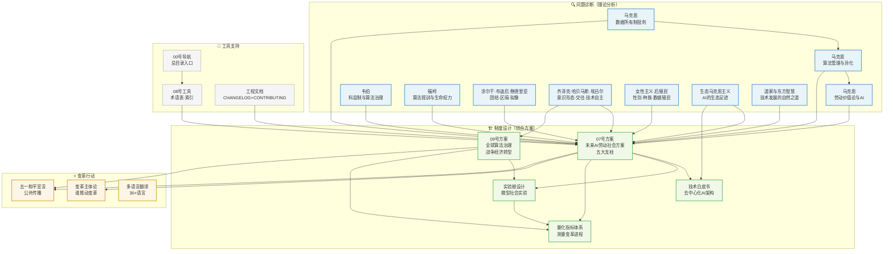
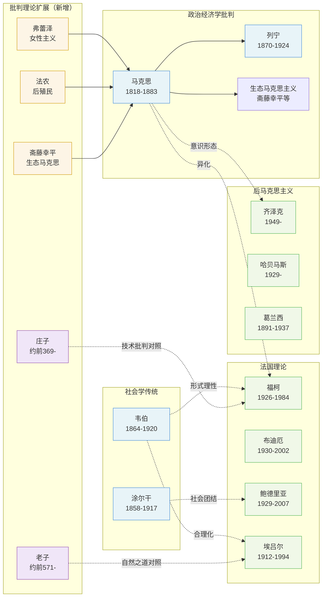
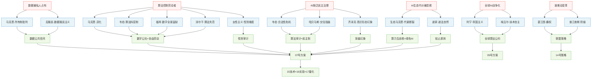
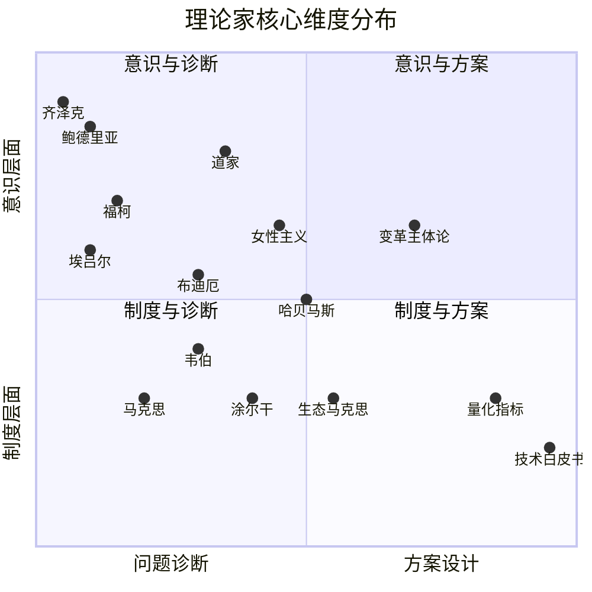

# AI劳动社会设计——理论家关系图谱

> 生成日期：2026-05-02
> 说明：使用Mermaid.js语法，可视化展示本项目所有理论家之间的关系

---

## 一、理论全貌：从诊断到方案

---

## 二、理论家谱系图

---

## 三、问题-理论-方案映射

---

## 四、理论家核心贡献速查

---

> **心法：** 如同一张地图，此图谱帮助你定位每位思想家的贡献位置。但请记住——地图不是疆域。真正的理解需要在阅读原文、体悟思想、观察现实的过程中不断深化。

[↑ 返回导航](00_总目录与导航.md)
